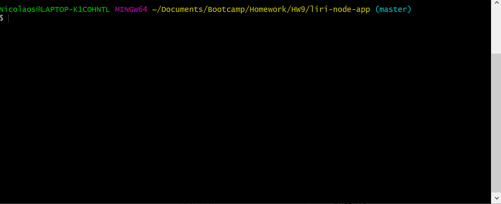
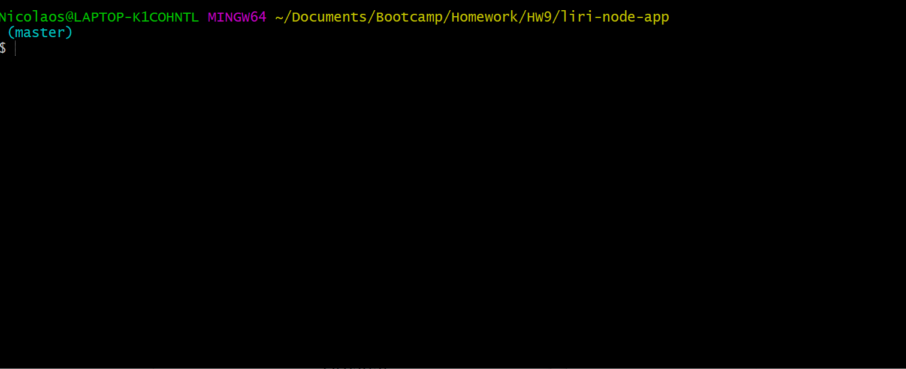
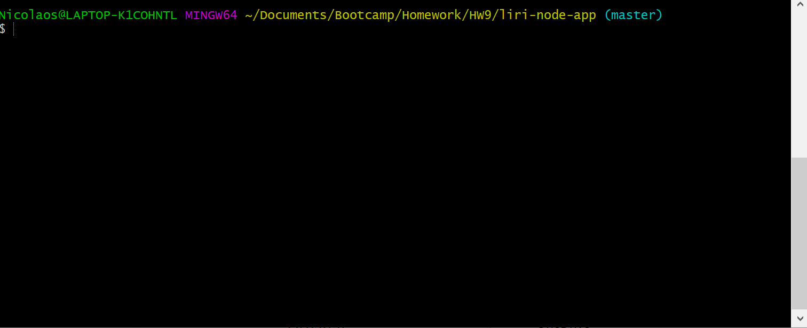
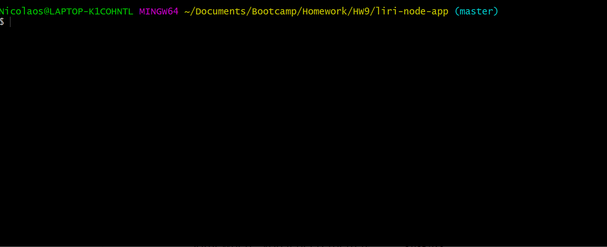
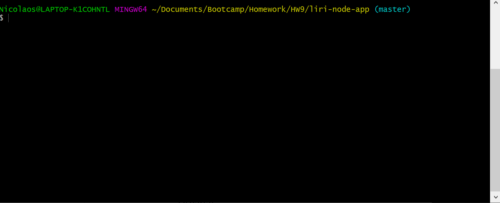
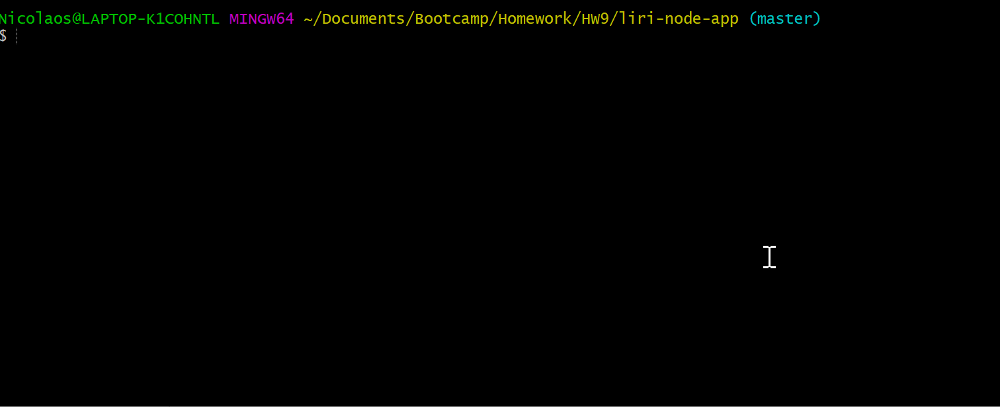

# liri-node-app
### Concept
Liri is a command line application which can search for song, movie, or upcoming concert information.  

### Setup
After cloning this folder to your computer, run the command "npm install" to install all the dependancies required to run this app.

### Usage

Use the following commands to make a request:

1) To request information on a song, type "node liri.js spotify-this-song XXXX", where XXXX is the song title (or a fraction of it).

If no song is given, "The Sign" by Ace of Bass is submitted.

2) To request information on a movie, type "node liri.js movie-this XXXX", where XXXX is the title of of a movie (or a fraction of it).

    If no song is given, "The Sign" by Ace of Bass is submitted.

3) To request information on upcoming concerts, type "node liri.js concert-this XXXX", where XXXX is the artist's name.

    If no artist is given, 
4) The command "node liri.js do-what-it-says" returns the information for a certain Back Street Boys song.

